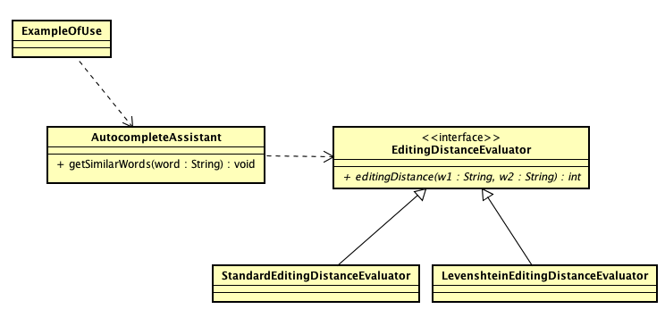

### Escuela Colombianan de Ingeniería
### Procesos de Desarrollo de Software - PDSW
#### Parcial Primer tercio

#### Nota: Se debe trabajar en Linux para no tener problemas con los comandos indicados al final.

### Antes de iniciar

Clone los fuentes de los tres puntos (no los descargue directamente!):

```bash
git clone https://gitlab.com/PDSW/2018-1-Parcial-1T.git
```

### Punto 1 (Carpeta CAD_Macros)

Para este ejercicio se va a retomar la herramienta CAD, la cual ya tiene
implementadas las funcionalidades de transformación, e integra el patrón Comando
para dar soporte a las funciones de deshacer/rehacer.

Se quiere hace una mejora adicional: soporte para MACROS, similar a la que
existe en herramientas como Excel y Photoshop. Una MACRO es una secuencia de
acciones grabadas (por ahora grabadas sólo en memoria, y sólo UNA MACRO a la
vez) que podrán repetirse tantas veces como se quiera. Cuando se activa la
opción de 'grabar macro', se 'grabará' la secuencia de comandos que se realicen
hasta cuando se elija la opción de 'detener grabación'. Cuando se haga esto
último, se habilitará la opción de 'ejecutar macro', la cual repetirá las N
acciones realizadas.

Por ejemplo, la siguiente secuencia de acciones debería ser viable una ves
habilitada esta funcionalidad:

* Activar grabación de macros.
* Dibujar una casa.
* Detener grabación de macros.
* Crear un nuevo dibujo.
* Ejecutar macro (dibuja de nuevo la casa)
* Rotar la partes de la casa.
* Ejecutar macro (dibuja de nuevo la casa, quendo dos casas)

Plantee un uso alternativo del patrón comando (aprovechando que ya está
implementado para el hacer/deshacer) para agregar esta funcionalidad, haciendo
uso de los métodos definidos en el controlador, y ya asociados a la interfaz
gráfica. Tenga también en cuenta que sólo se puede grabar una MACRO a la vez,
por lo que al hacer una nueva grabación, se sobreescribirá la MACRO anterior.

Nota: NO es necesario considerar las operaciones de deshacer/rehacer dentro de
los MACROS (es decir, el 'deshacer/rehacer' no queda grabado en el MACRO). Sin
embargo, si esto se logra, se dará un bono en la evaluación.


### Punto 2 (Carpeta NLangUtils-SpellChecker)

La clase 'AutocompleteAssistant' es un módulo de una librería que puede ser
utilizada en herramientas que requieran la edición de texto, tales como
procesadores de palabras o clientes de correo. Dicha librería depende de un
evaluador de "distancia de edición", una medida que define el grado de similitud
de dos palabras, y que indica aproximadamente cuantas operaciones de inserción y
borrado se requieren para convertir la palabra 1 en la palabra 2.



En la clase ExampleOfUse, se muestra un ejemplo de uso del
'AutocompleteAssistant', el cual, como se ve en el diagrama, depende de la
interfaz 'EditingDistanceEvaluator', la cual tiene la siguiente especificación
para el método 'editingDistance':

```java
    /**
     * Calcular la distancia de edición entre dos cadenas
     * de texto
     * @pre sin precondicion
     * @param word1 primer texto a comparar
     * @param word2 segundo texto a comparar
     * @return distancia de edición tal que, a menor diferencia,
     * menor valor. En caso de que word1 o word2 sean nulos, éstos 
     * se tomarán como si fueran cadenas vacías, y la función
     * devolverá la distancia de edición correspondiente.
     */
    int editingDistance(String word1, String word2);
```

En el ejemplo, la instancia de AutocompleteAssistant está haciendo uso de
'StandardEditingDistanceEvaluator', pero se quiere hacer uso del evaluador de
distancia de edición "LevensLevenshteinEditingDistanceEvaluator", la cual
redefine la especificación del método de la siguiente manera:

```java
    /**
     * Calcular la distancia de edición entre dos cadenas
     * de texto
     * @pre word1!=null
     * @pre word2!=null
     * @param word1 primer texto a comparar
     * @param word2 segundo texto a comparar
     * @return distancia de edición tal que, a menor diferencia,
     * menor valor. 
     */    
    @Override
    public int editingDistance(String word1, String word2) {
```

1. Revise y anote en su hoja de respuestas (archivo RESPUESTAS.txt). Qué
   principio S.O.L.I.D. está relacionado con los errores que se producen al
   cambiar StandardEditingDistanceEvaluator por
   LevenshteinEditingDistanceEvaluator?. Que patrón sería aplicable para
   resolver el problema, y poder hacer uso de
   LevenshteinEditingDistanceEvaluator sin que se generen errores?

2. Implemente la solución antes indicada.

### Punto 3 (Carpeta LinkedListTesting)


La clase MisteryList es una implementación del TAD Lista Encadenada. Esta lista
tiene la particularidad de sólo permitir la inserción en la cabeza de la lista
(headInsert), y de ofrecer operaciones como la eliminiación de duplicados.

Se sabe que el método de eliminiación de duplicados tiene un par de defectos,
pero el código está 'obfuscado' y las pruebas implementadas hasta el momento
(basadas en dos clases de equivalencia y una condición de frontera) no arrojan
aún pistas al respecto:

```java
/**
 *
 * Clases de equivalencia, metodo removeDup
 * 
 * CF1: Lista [E1]. TIPO: Frontera. Resultado esperado: Lista [E1]
 * CE1: Lista [E1,E2,E3,...,E(N)], donde E1!=E2!=E3...!=E(N). TIPO: Normal. Resultado esperado: Lista [E1,E2,E3,...,E(N)]
 * CE2: Lista [E1,E2,E2,[E3]], donde la sublista E3 no contiene a E2 TIPO: Normal. Resultado esperado: Lista [E1,E2,[E3]]
 * 
 */

```

1. Teniendo en cuenta las especificaciones del método deleteDup():

	```java
    /**
     * @obj Remueve los elementos duplicados de la lista
     * @pre True
     * @pos Para cada elemento E de la lista que este 2 o mas veces,
     * la lista deja solo un elemento del mismo. Si los elementos
     * repetidos no son contiguos (por ejemplo, el tercer, quinto y decimo
     * elemento), la posicion donde se dejara el valor sera siempre
     * la del elemento que estaba mas cerca de la cabeza de la lista
     */
    public void deleteDup()
    ```

    agregue, en los comentarios de la clase DeleteDuplicateTest las clases de
    equivalencia y condiciones de frontera que considere hacen falta tenerse en
    cuenta.
    
 
2. Implemente las pruebas correspondientes, teniendo cuidado de dejar en los asserts los mensajes que indiquen claramente -en caso de que la prueba genere un fallo- cual es el defecto identificado para la lista.

3. En la hoja de respuestas decriba clara, pero brevemente, que defectos tiene el TAD.

## Entrega

Siga al pie de la letra estas indicaciones para la entrega de este punto. EL
HACER CASO OMISO DE ESTAS INSTRUCCIONES PENALIZARÁ LA NOTA.

1. Limpie los tres proyectos

	```bash
    $ mvn clean
    ```

1. Configure su usuario de GIT

	```bash
    $ git config --global user.name "Juan Perez"
    $ git config --global user.email juan.perez@escuelaing.edu.co
    ```

2. Desde el directorio raíz (donde está este archivo README.md), haga commit de
   lo realizado.

	```bash
    $ git add .
    $ git commit -m "entrega parcial - Juan Perez"
    ```


3. Desde este mismo directorio, comprima todo con: (no olvide el punto al final de la instrucción)

	```bash
    $ zip -r APELLIDO.NOMBRE.zip .
    ```
4. Abra el archivo ZIP creado, y rectifique que contenga lo desarrollado.

4. Suba el archivo antes creado (APELLIDO.NOMBRE.zip) en el espacio de moodle correspondiente.

5. IMPORTANTE!. Conserve una copia de la carpeta y del archivo .ZIP.
 

